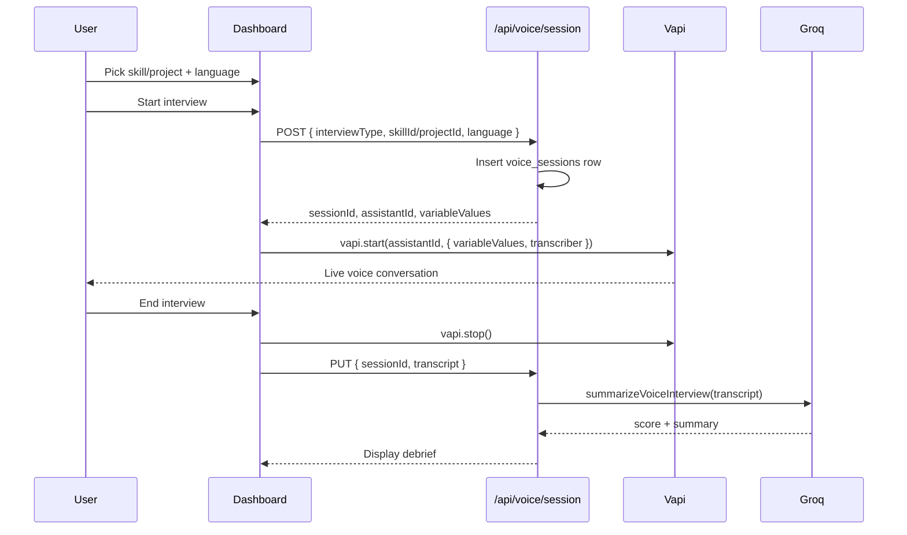

# Vapi Voice Interview Setup

This guide covers everything needed to run live AI voice mock interviews in ResumeInterview using [Vapi](https://vapi.ai).

---

## Overview

| Layer | Responsibility |
|---|---|
| **Vapi** | Real-time STT (Deepgram) + TTS (Vapi voice); routes LLM to your custom endpoint |
| **Custom LLM** (`/api/voice/chat/completions`) | Intent classification, interview state, edge-case-aware responses (Groq) |
| **Next.js app** | Resume context, session tracking, transcript UI, post-call AI summary |
| **Groq** | Live interview turns (custom LLM) + resume parse + post-interview debrief |

---

## Part 1 — Environment variables

Add these to `.env.local` (and Vercel production env):

| Variable | Where to get it |
|---|---|
| `NEXT_PUBLIC_VAPI_WEB_TOKEN` | Vapi Dashboard → **API Keys** → Public / Web key |
| `NEXT_PUBLIC_VAPI_ASSISTANT_ID` | Vapi Dashboard → **Assistants** → `ai-interview-platform` → copy full Assistant ID |
| `GROQ_API_KEY` | [console.groq.com](https://console.groq.com/keys) — live interview + resume parse + summary |
| `NEXT_PUBLIC_APP_URL` | Public URL of your app (e.g. `http://localhost:3000` or production domain). **Required** for Vapi custom LLM. Use [ngrok](https://ngrok.com) for local dev. |
| `VAPI_LLM_SECRET` | Optional — set a secret and configure Vapi to send `x-vapi-secret` header |

Example:

```bash
NEXT_PUBLIC_VAPI_WEB_TOKEN=your-public-web-key
NEXT_PUBLIC_VAPI_ASSISTANT_ID=4b4969xx-xxxx-xxxx-xxxx-xxxxxxxx77a4e
GROQ_API_KEY=gsk_...
```

> Both `NEXT_PUBLIC_*` vars are exposed to the browser (required by the Vapi Web SDK). Never put private API keys in `NEXT_PUBLIC_` variables.

---

## Part 2 — Vapi Dashboard configuration

### Step 1: Open your assistant

1. Go to [dashboard.vapi.ai](https://dashboard.vapi.ai)
2. Select **Assistants** → **ai-interview-platform**
3. Copy the full **Assistant ID** into `NEXT_PUBLIC_VAPI_ASSISTANT_ID`

### Step 2: Model — Custom LLM (recommended)

The app overrides the model at call start to use your **custom LLM endpoint** with intent classification and state tracking. You do **not** need Groq configured in the Vapi dashboard.

In the Vapi dashboard, you can leave a placeholder model or set **Custom LLM** to your deployed URL:

```
https://your-domain.com/api/voice/chat/completions
```

The client also passes this override automatically via `vapi.start()`.

> **Local development:** Vapi must reach your server over the public internet. Run `ngrok http 3000` and set `NEXT_PUBLIC_APP_URL` to the ngrok URL.

### Step 2b: (Optional) Dashboard Groq model

If not using custom LLM, set provider to **Groq** with `llama-3.3-70b-versatile`. Custom LLM is strongly recommended for realistic edge-case handling.

### Step 3: Transcriber (STT)

Keep **Deepgram** as transcriber. The app overrides language per session based on the user's dashboard selection (English, Hindi, Spanish, etc.).

Default in dashboard: **English** is fine.

### Step 4: Voice (TTS)

Keep **Vapi (Elliot) v2** or choose any voice you prefer. This only affects how the interviewer sounds.

### Step 5: First message

Set **Assistant speaks first** with:

```
Hello {{username}}, let's prepare for your interview!
```

### Step 6: System prompt

Replace the placeholder template with:

```
You are a senior technical interviewer conducting a {{interviewType}} mock interview.

Interview language: {{interviewLanguage}}
Conduct the interview primarily in this language.

Context from the candidate's resume:
{{interviewContext}}

Interview guidelines (follow on every turn):
{{interviewGuidelines}}

Rules:
- Ask one question at a time. Wait for the candidate to finish before follow-ups.
- For project interviews: probe architecture, trade-offs, challenges, and impact.
- For skill interviews: mix conceptual, practical, and scenario-based questions about {{skillName}}.
- Keep responses concise (2–4 sentences) unless explaining a follow-up.
- Be professional but encouraging. Push back gently when answers are vague.
- Do not invent resume details not present in the context.
- After 8–12 exchanges, wrap up with brief closing feedback.
```

### Step 7: Template variables

The app passes these via `variableValues` when starting a call:

| Variable | Description |
|---|---|
| `username` | Candidate's first name from Google sign-in |
| `interviewType` | `skill` or `project` |
| `interviewLanguage` | Human-readable language label (e.g. `English`) |
| `interviewContext` | Resume-derived context (skill or project details) |
| `interviewGuidelines` | Condensed edge-case handling rules (auto-injected by the app) |
| `skillName` | Set for skill interviews |
| `projectTitle` | Set for project interviews |

Make sure your first message and system prompt use `{{username}}`, `{{interviewContext}}`, etc. exactly as shown.

### Step 8: Publish

Click **Publish** in the top-right. Unpublished changes are not applied to live calls.

### Step 9: Test in dashboard

Use the **Talk** button in the Vapi dashboard to verify the assistant responds before testing in the app.

---

## Part 3 — Codebase architecture

### Files added / updated

```
lib/vapi/vapi.sdk.ts              # Vapi client helpers + variable types
lib/voice/languages.ts            # Interview language options
components/voice/voice-interview-hub.tsx    # Dashboard hub + language selector
components/voice/voice-interview-panel.tsx    # Live Vapi call UI
app/api/voice/session/route.ts    # Create session + return variableValues; summarize on end
app/(dashboard)/voice/skill/[skillId]/page.tsx
app/(dashboard)/voice/project/[projectId]/page.tsx
```

### Voice interview flow



### Database (`voice_sessions`)

After schema changes, run:

```bash
npm run db:push
```

New columns:

- `interview_type` — `skill` | `project`
- `skill_id` — nullable FK to skills
- `project_id` — now nullable
- `interview_language` — e.g. `en`, `hi`

---

## Part 4 — Running locally

1. Fill in all env vars (see `.env.example`)
2. Push DB schema: `npm run db:push`
3. Configure and **Publish** the Vapi assistant (Part 2)
4. Start dev server: `npm run dev`
5. Sign in → complete onboarding → Dashboard
6. Select interview language → pick a skill or project → **Start interview**
7. Allow microphone access when prompted
8. End interview → wait for Groq-generated summary

---

## Part 5 — Troubleshooting

| Issue | Fix |
|---|---|
| `NEXT_PUBLIC_VAPI_ASSISTANT_ID is not configured` | Add assistant ID to `.env.local` and restart dev server |
| Call fails immediately | Verify public web token (not private key); check browser mic permissions |
| Assistant uses wrong language | Republish assistant; confirm `{{interviewLanguage}}` in system prompt |
| No transcript lines | Ensure Deepgram transcriber is enabled; check Vapi call logs |
| Summary fails after call | Verify `GROQ_API_KEY`; transcript must not be empty |
| Custom LLM 404 / timeout | Set `NEXT_PUBLIC_APP_URL` to a publicly reachable URL; use ngrok locally |
| `sessionId metadata is required` | Ensure app passes `metadata: { sessionId }` in `vapi.start()` overrides |

### Vapi logs

Dashboard → **Logs** shows call recordings, transcripts, and errors for debugging.

---

## Part 6 — Production (Vercel)

1. Add all env vars from `.env.example` in Vercel project settings
2. Run `npm run db:push` against production Neon DB
3. Ensure Vapi assistant is **Published**
4. Test microphone over HTTPS (required in production; localhost is exempt)

---

## Part 7 — Realistic interviewer edge cases

The custom LLM pipeline (`lib/voice/`) handles conversational edges that separate a Q&A bot from a real interviewer.

### Architecture

```
Candidate speaks → Vapi STT → POST /api/voice/chat/completions
  → classify intent (Groq)
  → update interview state (DB)
  → generate response with intent-specific strategy + style + acknowledgment pool
  → Vapi TTS → Candidate hears reply
```

### Intent classification

Each candidate turn is classified into one of 25 intents (e.g. `dont_know`, `hint_request`, `rambling`, `strong_answer`, `skip_request`). See `lib/voice/intent-classifier.ts`.

### State tracking (per session)

Stored in `voice_sessions.interview_state`:

| Field | Purpose |
|---|---|
| `dontKnowStreak` | Detect repeated "I don't know" → pivot topics |
| `hintsGiven` / `hintsByTopic` | Avoid repeating the same hint |
| `skipsUsed` / `skippedTopics` | Honor skip requests without over-skipping |
| `weakAreas` | Track struggling domains |
| `recentPhrases` | Rotate acknowledgments ("Got it" vs "That makes sense") |

### Interviewer styles (dashboard selector)

| Style | Behavior |
|---|---|
| **Supportive** | More hints, reassurance, patience with pauses |
| **Balanced** | Default realistic mix |
| **Efficient** | Fewer hints, moves on faster when stuck |

### Edge categories covered

1. **Knowledge gaps** — partial answers, wrong answers, hints, guessing
2. **Clarification** — misunderstandings, repeat/simpler requests, partial multi-part answers
3. **Pacing** — short answers, rambling, thinking pauses, explicit time requests
4. **Emotional signals** — nervous, frustrated, overconfident
5. **Skipping logic** — skip requests, repeated don't-know, proactive pivot
6. **Depth adjustment** — strong answers probed deeper; textbook answers get scenario follow-ups
7. **Conversational realism** — varied acknowledgments, natural transitions, meta questions
8. **Wrap-up** — natural close after ~10 exchanges

See `lib/voice/interviewer-prompt.ts` for per-intent response strategies.

---

## What was removed

- Written practice mode (`/practice/*`)
- Seed question banks and LLM fallbacks
- Browser Web Speech API voice implementation

All live interview content is generated dynamically. If the LLM fails, the UI shows an error — no hardcoded fallback content.
